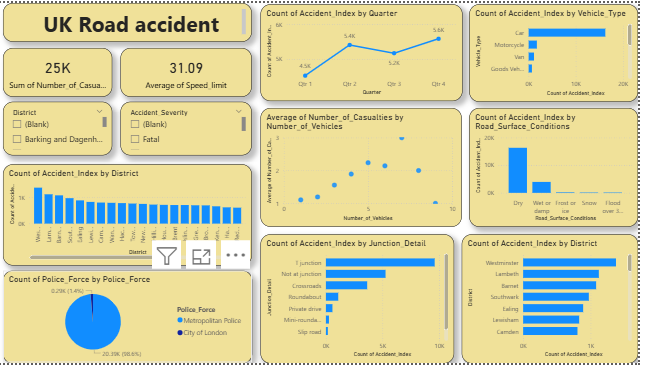

# UK Road Accident Dashboard

## 📊 Project Overview
This Power BI dashboard analyzes UK road accident data, accident severity, vehicle involvement, road conditions, and district-wise accident trends.

## 🚀 Key Features
- Accident Trend Analysis
- Vehicle Type Insights
- Road Surface Condition Analysis
- District-wise Accident Distribution
- Casualties Analysis
- Junction Detail Insights
- Quarterly Accident Trends

## 🛠 Tools Used
- Power BI
- Data Analytics
- Data Visualization

## 📷 Dashboard Preview

